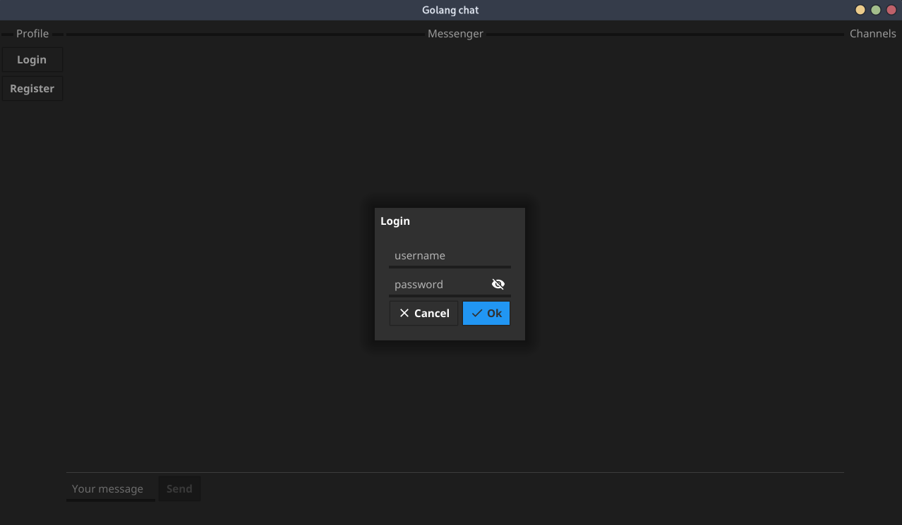

# golang-chat
Курсовая работа 3 семестр

# Screenshots





# Install dependencies
```
cd golang-chat/
go get .
```

# How to run

Run server instance
```
go run ./server.go
```

Run client instance
```
go run ./client.go
```
You can run multiple clients from another pc or another terminal tabs.
All clients must be in one local network or use [port forwarding](https://en.wikipedia.org/wiki/Port_forwarding).


# How to build

Build and run server instance
```
go build ./server.go
./server
```

Build and run client instance
```
go build ./client.go
./server
```
